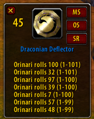

Raid Roll Buddy 1.0.0
===

RaidRollBuddy is a createt for TurtleWoW.
It helps with rolling for loot in raids when the loot distribution is MS > OS.
When a single uncommon+ item is announced as Raidwarning it opens a window listing the rolls, provides buttons for rolling, and displays the item being rolled for.

Default frame duration to stay on screen without a new /roll occuring is `20 seconds`, change with:  
`/RRB <number>`  
Make the frame appear to move it with:  
`/RRB`

### The moveable frame in game:  
  

* This addon is based on `Weird Vibes` LootBlare